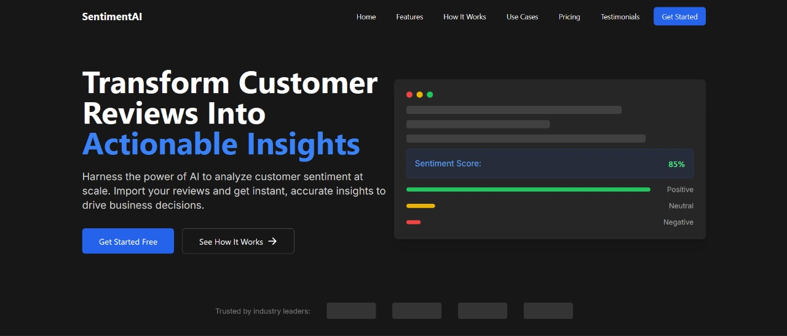

# Sentiora

## A Customer Sentiment Analysis Tool

## Description

Building a Customer Sentiment Analysis Tool for businesses that analyzes customer feedback from surveys, reviews, and other text-based data to extract insights about customer sentiment.

## Problem We Are Solving

1. **Overwhelming Volume:** For businesses with a large customer base, the sheer number of reviews can be overwhelming, making it difficult to analyze each one.

2. **Time Constraints:** Business owners often have limited time to dedicate to reading and understanding all customer feedback due to other priorities.

3. **Difficulty Identifying Trends:** Without proper tools or analysis, it’s challenging to identify patterns, recurring issues, or trends from scattered reviews.

4. **Understanding Sentiment:** Reviews often vary in tone, and it can be hard to gauge overall customer sentiment without advanced tools.

## Built With

- [Azure](https://azure.microsoft.com/en-gb/)
- [Nextjs](https://nextjs.org/)
- [Shadcn](https://ui.shadcn.com/)
- [tailwindcss](https://tailwindcss.com/)
